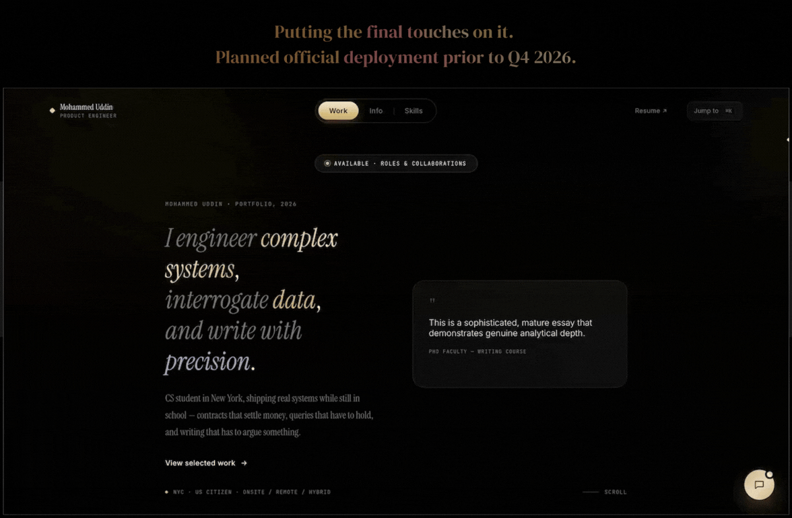

  <h1>Full-Stack Development</h1>

### [Cinegraph (Streaming Commerce Platform)](#)

**Cinegraph** showcases both product design and full-stack engineering: a deliberately iterated visual design system (typography, color, motion, accessibility) paired with a complete application stack –– REST + GraphQL APIs, a relational database with transactional integrity, and third-party API integration with a secure backend proxy pattern.

  

[⬅ Back to Contents](#contents)

---

[View more examples of **Product & Visual Design**.](https://github.com/cryp-moh-graphy/fullstack-product-design)

### [Personal Website / Portfolio](#personal-website--portfolio) — **iM-Engr**

[**iM-Engr**](https://github.com/cryp-moh-graphy/personal-website/blob/main/README.md) is a personal portfolio focused on **front-end development and product design**, combining high-end editorial typography with a modern, minimal user interface.

Although iM-Engr is not a full-stack application, the project demonstrates product-oriented front-end development, visual design, interaction design, and a polished editorial-style web experience.

The portfolio also features a [**deterministic, client-side conversational retrieval system**](https://github.com/cryp-moh-graphy/ai-ds-portfolio/tree/main/Zero-Dependency%20Client-Side%20NLP%20%26%20Conversational%20Assistant) that operates without AI, external APIs, embeddings, or other external services.

[Learn More more about iM-Engr](https://github.com/cryp-moh-graphy/personal-website/blob/main/README.md)
   
    

   **Product demo — iM-Engr (09.01.26)**

   

     
   

[⬅ Back to Contents](#contents)

---
